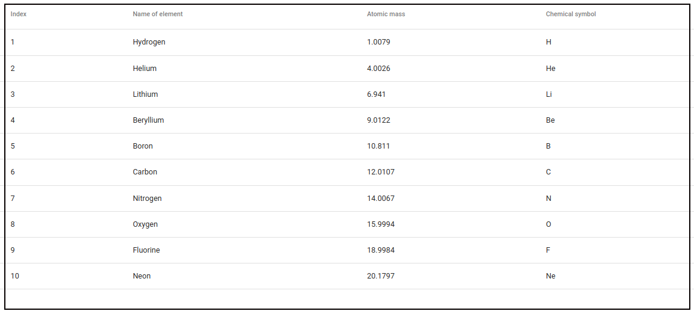

# Angular CSV to Material Table

An example application which converts a csv file to a [material table](https://material.angular.io/components/table/overview) on the fly.



## Introduction

This is a simple demo application that shows you how to read the contents of a csv file and transform it automatically to a table.

The csv file is located at `assets/data.csv` and is loaded using `HttpClient` like this:

```
this.http.get('assets/data.csv', { responseType: 'text' })
    .subscribe(data => this.handleData(data));
```

The loaded data is passed to the [Papa Parse](https://www.npmjs.com/package/ngx-papaparse) CSV parser like this:

```
this.papa.parse(data, options);
```

where the configuration is:

```
const options: ParseConfig = {
    complete: results => this.handleComplete(results),
    delimiter: ',',
    header: true
};
```

The first record in the csv file is treated as the `header: true` header from which the column names are extracted.

The column names are in turn formatted into nicer looking title, for instance:

* `name_of_element` becomes `Name of element`,
* `atomic_mass` becomes `Atomic mass`, and
* `chemical_symbol` becomes `Chemical symbol`

## Getting started

First execute the following commands:

```
git clone git@github.com:kgish/angular-csv-to-material-table.git
cd angular-csv-to-material-table
npm install
npm start
```

Then point your favorite browser to http://localhost:4200.

## References

* [Angular](https://angular.io/)
* [Angular Material](https://material.angular.io/)
* [Papa Parse](https://www.npmjs.com/package/ngx-papaparse)
